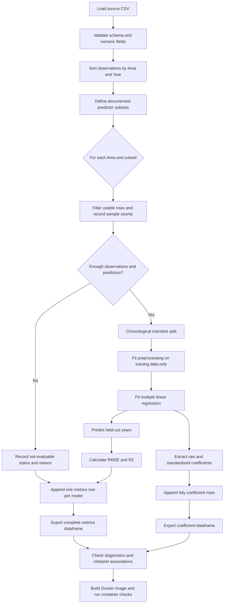

# Implementation Plan: Per-Area Multiple Linear Regression

## Goal

Create a separate repository that expands Question 3 of IDS706-Assignment-2 by
estimating how a set of predictors is associated with `total_emission` for each
`Area`. Fit multiple linear regression models independently by Area, compare
defined predictor subsets, and retain the RMSE and R-squared (`R2`) for every
successfully evaluated model in one results dataframe.

The analysis estimates associations, not causal effects. Coefficients describe
relationships conditional on the other variables in a model.

## Main requirements

- Use the agrofood emissions dataset and preserve its column names, including
  `Area`, `Year`, and `total_emission`. Resolve the average-temperature header
  in the source CSV explicitly (the README and CSV header may encode/name it
  differently) and map it to one documented internal feature name.
- Fit a multiple linear regression for each Area and each planned predictor
  subset. Exclude `Area` and `total_emission` from predictors.
- Use a reproducible, chronological train/test split within each Area; do not
  randomly shuffle annual observations.
- Report per-feature coefficients in original units and standardized
  coefficients so relative coefficient magnitudes can be compared within a
  model.
- Store one metrics row per Area and predictor subset. Include at least
  `Area`, model/subset name, predictors, train/test observation counts, RMSE,
  and `R2`. Persist the complete table as a CSV.
- Record unevaluable Area/subset combinations and reasons (for example,
  insufficient complete observations or a constant training target) rather
  than silently omitting them.
- Make the analysis reproducible from a documented command and test it with a
  small fixture.

## Proposed predictor subsets and modeling steps

Use a small, explicitly named set of model specifications rather than fitting
every possible combination. The source dataset has only a few dozen annual
observations per Area, so a model with every available column would have too
many parameters and unstable estimates.

1. **Prepare a common analysis table.** Load and validate required columns;
   coerce numeric fields; sort by `Year` within `Area`; exclude rows missing
   the target or required predictors for a given specification.
2. **Define and validate subsets.** Start with:
   - `time_climate`: `Year`, canonical `average_temperature`.
   - `population_climate`: `Year`, `average_temperature`,
     `Rural population`, `Urban population`, `Total Population - Male`,
     `Total Population - Female`.
   - `population_climate_sensitivity`: a sensitivity specification with
     `Year`, `average_temperature`, `Rural population`, and `Urban population`,
     omitting the male/female population group.
   - `land_fire`: `Year`, `Forestland`, `Net Forest conversion`,
     `Forest fires`, `Fires in organic soils`,
     `Fires in humid tropical forests`.
   - `agrofood_sources`: evaluate the following named source groups as
     separate subsets, each including `Year`:
     - `agriculture_inputs`: `Crop Residues`, `Rice Cultivation`,
       `Pesticides Manufacturing`, `Fertilizers Manufacturing`.
     - `fire_and_soils`: `Savanna fires`, `Forest fires`,
       `Drained organic soils (CO2)`, `Fires in organic soils`,
       `Fires in humid tropical forests`.
     - `food_chain_upstream`: `Food Transport`, `Food Processing`,
       `Food Packaging`.
     - `food_chain_downstream`: `Food Household Consumption`,
       `Food Retail`, `Agrifood Systems Waste Disposal`.
     - `livestock_manure`: `Manure applied to Soils`,
       `Manure left on Pasture`, `Manure Management`.
     - `farm_energy_industry`: `On-farm Electricity Use`,
       `On-farm energy use`, `IPPU`.
   - `combined`: `Year`, `average_temperature`, and `Food Transport`, a
     documented curated combination selected to limit predictors while
     retaining a time, climate, and food-chain feature.

   Treat these as initial specifications to validate against the actual input
   schema. The `population_climate` subset intentionally includes both
   male/female and urban/rural population measures; assess and report their
   multicollinearity, and consider a sensitivity model that omits one
   population-measure group if estimates are unstable. Never include
   `total_emission` as a predictor. Validate every listed source field against
   the input schema and document any unavailable field rather than silently
   dropping it. Component emission fields can overlap mathematically with the
   target; identify source-group models as predictive/accounting
   relationships, not independent causal explanations.
3. **Split and scale without leakage.** For each Area and subset, split the
   earliest 80% of usable years for training and the latest 20% for testing.
   Fit any scaling using training data only; use a pipeline so preprocessing
   cannot use held-out observations.
4. **Fit each model.** Fit ordinary least squares multiple linear regression
   on the training observations. Keep the same split policy across subsets
   for an Area when their available observations permit it; record differing
   counts when missingness prevents this.
5. **Evaluate and collect.** Predict the held-out years and calculate
   `RMSE = sqrt(mean_squared_error(y_test, predictions))` and
   `R2 = r2_score(y_test, predictions)`. Add one row per evaluated
   Area/subset to the metrics dataframe. Keep coefficient records in a
   separate tidy dataframe keyed by Area, subset, and predictor.
6. **Export and interpret.** Write metrics and coefficient tables to the
   analysis output directory. Sort metrics by Area and RMSE, and discuss
   standardized coefficients alongside holdout performance, uncertainty, and
   diagnostics; do not rank variables by coefficient size alone.

If an Area has too few rows to produce a meaningful chronological test split
or its training target is constant, mark that Area/subset as unevaluable and
retain the reason in a status/results table. If the held-out target is
constant, retain the model's RMSE and report an undefined `R2` with an
explicit status and reason. Do not replace undefined `R2` with a misleading
numeric value.

## Proposed changes in the new repository

- Keep the original assignment repository unchanged; create a new repository
  with a focused analysis package or script, tests, documentation, and
  versioned dependency declarations.
- Reuse the existing dataset only with its source and license/usage terms
  documented. If data should not be committed to the new repository, provide
  an explicit download/input path and a clear missing-data error.
- Implement separate responsibilities for data validation/preparation,
  predictor-subset definitions, per-Area fitting/evaluation, coefficient
  extraction, and output writing.
- Add a command-line entry point that accepts an input CSV path and output
  directory, with deterministic defaults and a non-interactive execution
  path.
- Containerize the analysis so the same documented interface can run in a
  clean environment. Build an image with declared runtime dependencies and
  application code; pass datasets and output directories into containers as
  mounted paths rather than baking private or large input data into the image.
- Document image build, container test, and analysis-run commands in the
  README. Give the container a non-interactive default and keep analysis
  outputs on a mounted host directory so they persist after the container
  exits.
- Include generated metrics and coefficient CSVs as run outputs, not as
  hand-maintained source files.
- Document the feature definitions, split strategy, interpretation limits,
  output schemas, and run/test commands in the new repository README.

## Important files (proposed)

| File | Purpose |
|---|---|
| `src/analysis.py` | Load/validate data, define feature subsets, fit and evaluate per-Area OLS models, and return metrics and coefficients. |
| `src/cli.py` or `run_analysis.py` | Parse input/output paths and run the complete analysis. |
| `tests/test_analysis.py` | Unit tests for validation, subset filtering, splitting, coefficient extraction, metrics, and edge cases. |
| `tests/fixtures/` | Small deterministic CSV fixtures, including multiple Areas and missing values. |
| `Dockerfile` | Build a reproducible image with runtime dependencies, application code, and a documented default command. |
| `.dockerignore` | Exclude virtual environments, caches, generated outputs, and unnecessary local files from the build context. |
| `requirements.txt` or `pyproject.toml` | Declare pandas, NumPy, scikit-learn, and any inference library selected. |
| `README.md` | Explain data provenance, analysis choices, usage, outputs, and limitations. |
| `docs/plan.md` | This implementation plan and the accepted modeling design. |
| `outputs/` (generated) | Per-run metrics and coefficient CSVs; exclude reproducible outputs from version control unless a reviewed example is useful. |

## Design concerns and risks

- **Small samples per Area:** Annual history is short relative to the number
  of available fields. Too many predictors cause overfitting and unstable
  estimates. Keep subsets small, report sample counts, and require
  substantially more training rows than fitted parameters.
- **Time-series behavior:** A chronological holdout better reflects future
  prediction than a random split, but a single final segment can be sensitive
  to unusual years. Treat results as exploratory; consider rolling-origin
  validation only if the sample size supports it.
- **Collinearity and redundant fields:** Several population counts overlap,
  and emissions component fields may be strongly correlated or contribute
  directly to `total_emission`. Report diagnostics and avoid causal language.
- **Coefficient interpretation:** Raw coefficients depend on feature units.
  Standardized coefficients improve scale comparability but do not remove
  confounding or establish causation. If p-values/confidence intervals are
  required, use a suitable OLS inference implementation and explicitly
  document assumptions; they are not substitutes for predictive validation.
- **Missingness:** Complete-case filtering can leave different periods or
  sample sizes across subsets and Areas. Record per-model counts and avoid
  silent imputation; any future imputation must be fit on training data only.
- **Metric reliability:** `R2` may be negative on held-out data and may be
  undefined with fewer than two test observations or a constant test target.
  Preserve these cases as explicit statuses/NA values, not as zero.
- **Feature schema drift:** Validate all required columns and fail with a
  useful message if a planned field is absent; do not silently substitute a
  different feature set.
- **Data provenance:** Verify the dataset's source, license, and redistribution
  conditions before copying it into the new repository.

## Test plan

- Validate required-column handling, numeric coercion, Area/Year ordering, and
  preservation of the caller's input dataframe.
- Confirm target and Area identifiers are never predictors and that each
  feature subset uses only declared, available fields.
- Use a synthetic dataset with known linear relationships to verify
  per-Area model isolation, coefficient signs/values within tolerance, and
  deterministic chronological splitting.
- Verify every Area/subset yields exactly one metrics row and that the table
  includes the specified schema. Evaluated fits must have finite RMSE and a
  valid `R2`, except that a constant held-out target must retain finite RMSE,
  undefined `R2`, and an explicit `undefined_r2` status. Include all model
  subsets in the same dataframe rather than keeping only the best model.
- Cover missing values, too-few rows, constant predictors, constant test
  targets, absent columns, and one-Area/multiple-Area inputs. Check that
  skipped fits have explicit reasons and do not abort unrelated Areas.
- Test CLI argument handling and confirm output CSVs are written with the
  expected columns and row counts.
- Run the full unit test suite and a small end-to-end fixture analysis.
- **Basic test-case notes:** keep tests small, deterministic, and independent
  of network access or the full dataset. Include a happy path with two Areas
  and known linear signals; a schema/required-column failure; missing values
  with correct per-model row counts; insufficient observations; constant
  predictors; an undefined test-set `R2`; and checks that metrics and
  coefficient outputs match expected schemas. Assert numerical results with
  tolerances rather than exact floating-point equality.
- Build the image and run the test suite inside a container. Then run the
  analysis container with a fixture mounted read-only and a temporary output
  directory mounted read-write; confirm expected output files persist on the
  host. Verify a missing input path exits with a clear nonzero error.

## Verification and acceptance

1. Run the documented test command from a clean environment after installing
   declared dependencies.
2. Run the CLI against the small fixture and verify both metrics and
   coefficient outputs exist and are readable.
3. Confirm the metrics dataframe has one row for every evaluable
   Area/predictor-subset pair, includes RMSE and `R2`, and retains failures
   with explicit status/reason information.
4. Independently recompute RMSE and `R2` from a fixture's held-out target and
   predictions; verify the chronological split contains no training years
   later than test years.
5. Build and smoke-test the Docker image using the documented commands; run
   tests in the container, then execute a fixture analysis with mounted input
   and output directories and verify persisted results.
6. Run the documented command against the full dataset, inspect counts,
   residual behavior, coefficient stability, and warnings, and record
   limitations before interpreting or publishing conclusions.

## Implementation decisions

- Model specifications, statuses, metrics fields, coefficient extraction,
  and the CLI are implemented in `src/analysis.py` and `src/cli.py`.
- Each fit requires at least five training observations per predictor plus
  intercept, and at least two test observations. The final 20% of usable
  observations by year is held out.
- Missing planned predictors are retained as `missing_predictors` metrics
  rows. Constant training targets and insufficient samples are also explicit
  statuses; a constant test target retains RMSE and an undefined `R2`.
- The analysis CLI writes `metrics.csv` and `coefficients.csv`. The
  documentation uses the supplied Japan dataset for full-data checks and
  synthetic observations for deterministic coefficient and split tests.

Example Docker workflow (PowerShell, from the repository root):

```powershell
docker build -t agrofood-regression:local .
docker run --rm --entrypoint python agrofood-regression:local -m pytest
New-Item -ItemType Directory -Force .\outputs | Out-Null
docker run --rm `
  -v "${PWD}\Japan_Agrofood_co2_emission.csv:/data/japan.csv:ro" `
  -v "${PWD}\outputs:/results" `
  agrofood-regression:local --input /data/japan.csv --output-dir /results
```

The tests use deterministic synthetic data and do not require the full dataset.
Do not use a container cleanup command that removes unrelated images or
containers.

## Workflow diagram


