# CO2-emission — living plan

## Base — Pipeline diagram

The CSV is the source of truth. Every stage is independently runnable, exchanges data through `data/`, and is exposed to the classroom through the Makefile. Model runners remain separate processes; they do not import or call one another.

```mermaid
flowchart LR
    source["agrofood_co2_emission.csv"]
    simulator["Optional simulator"]
    raw[("data/raw/agrofood_co2_emission.csv")]
    preprocess["make preprocess"]
    features[("data/features/train.csv<br/>data/features/test.csv")]
    train["make train<br/>Makefile launches each model runner"]

    linear["Linear regression runner"]
    poly2["Degree 2 polynomial runner"]
    poly3["Degree 3 polynomial runner"]
    multiple["Multiple linear regression runner"]

    linearModel[("data/models/linear/")]
    poly2Model[("data/models/polynomial_2/")]
    poly3Model[("data/models/polynomial_3/")]
    multipleModel[("data/models/multiple_linear/")]

    infer["make infer"]
    linearPred[("data/predictions/linear/")]
    poly2Pred[("data/predictions/polynomial_2/")]
    poly3Pred[("data/predictions/polynomial_3/")]
    multiplePred[("data/predictions/multiple_linear/")]
    metrics["One metrics dataframe<br/>RMSE and R2 per model"]
    metricsFile[("data/predictions/model_metrics.csv")]
    dashboard["make dashboard"]

    source --> raw
    simulator -. optional source producer .-> raw
    raw --> preprocess --> features --> train
    train --> linear --> linearModel
    train --> poly2 --> poly2Model
    train --> poly3 --> poly3Model
    train --> multiple --> multipleModel

    linearModel --> infer
    poly2Model --> infer
    poly3Model --> infer
    multipleModel --> infer
    features -->|"test split"| infer
    infer --> linearPred
    infer --> poly2Pred
    infer --> poly3Pred
    infer --> multiplePred
    linearPred --> metrics
    poly2Pred --> metrics
    poly3Pred --> metrics
    multiplePred --> metrics
    metrics --> metricsFile --> dashboard
```



### Teaching beats

- Keep the stages loosely coupled: processes communicate through named files and folders under `data/`, not imports.
- Keep each statistical model's train and inference behavior and artifacts isolated in its own runner and model folder.
- Teach the Makefile as the public interface for orchestration: classroom demos and smoke tests use `make` targets, while Python modules are implementation details.
- Make the train write path visible (`data/features/` to `data/models/`) and the inference read path visible (test features plus saved models to `data/predictions/`).
- Collect each model's RMSE and R-squared into one metrics dataframe for comparison. These are predictive-fit metrics; by themselves they do not establish statistical significance of individual variables.
- Keep the dependency stack plain Python and local files; no containers, Kafka, or Spark.

### Planned Makefile surface

Targets are the commands students use as the project grows: `make install`, `make test`, `make simulator`, `make preprocess`, `make train`, `make infer`, `make dashboard`, `make run`, `make stop`, and `make clean-data`. Manual smoke-test instructions added with implementation stages should use these targets.

## Stage 0 — Pipeline foundation

### Goal

Establish the smallest reusable foundation for the CO2-emission pipeline: shared configuration, data paths, and a marked pytest layout.

### Proposed changes

- Add a `pipeline` package with a shared config interface (`load_config()`) and path helpers for `data/raw`, `data/features`, `data/models`, `data/predictions`, and `data/quality`.
- Add `ensure_data_dirs()` to create and return the configured data directories.
- Add unit, regression, and integration pytest markers and representative tests for config loading, path resolution, and directory creation.
- Add a Makefile as the public command interface, including `make install`, `make test`, and `make foundation` for the live foundation demo.

### Architecture / boundaries

- Keep shared configuration and filesystem helpers in `pipeline`; stages use these shared interfaces without importing one another.
- Resolve data paths from a single project-root-aware location so commands work independently of the caller's current directory.
- Keep handoffs file-based under `data/`; this stage creates no simulator, model, or application pipeline behavior.
- Use Make targets for classroom and smoke-test commands; `python -m` and inline Python remain implementation details behind Make targets.

### Automated tests

- Unit: verify config loading, each resolved data path, and idempotent directory creation.
- Regression: verify returned paths stay beneath the project `data/` directory.
- Integration: exercise `load_config()` and `ensure_data_dirs()` together in a temporary project/data location; verify all expected directories exist.
- Register and run the tests with pytest markers `unit`, `regression`, and `integration`; expose the suite through `make test`.

### Manual Smoke Test

#### What we're proving

The shared config loads, and the five expected data directories resolve and are created on disk through the Makefile.

#### Terminal

From the repository root:

```console
make foundation
```

The target should print the loaded config and the paths created by `ensure_data_dirs()`.

#### Watch for

- The loaded config is printed without errors.
- `data/raw`, `data/features`, `data/models`, `data/predictions`, and `data/quality` are listed and exist after the target completes.
- `make test` remains the automated test gate; it is not the live smoke demo.

#### Stop

No long-running process; the target exits after displaying the config and data paths.
